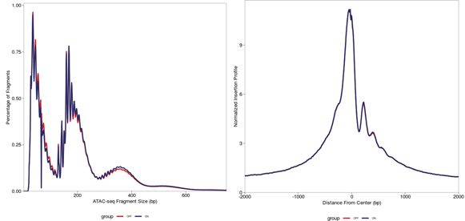
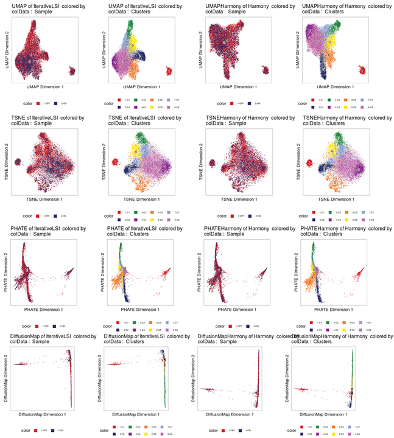

# The extended tools in scATAC

In this pages, we had summarized the `extended tools` mentioned in my scATAC analysis pipelines. The [Signac](https://github.com/timoast/signac/) and [ArchR](https://github.com/GreenleafLab/ArchR) are the most powerful and popular packages used in scATAC analysis. And both of them had individual advantages, such as `Signac` depends on `Seurat` pipelines,  which had a relative integrated analysis chain both in scRNA and scATAC. However, `ArchR` is much more sufficient and had more advanced `algorithms` to analysis scATAC data. However , the new version of `Signac` only supported the new version of `Seurat` which should be installed  on the `R > 4.0` platform, and recently,  I can't update my `R version `. So, I used the latest version of `ArchR` more frequently in these time. And the major `extended tools` are based on the `ArchR` platform. 

All the source codes of `extended tools` could be accessed and downloaded by click [here](source_codes/extend_dimension_reducing_in_Archr.R), which were under the `/source_codes`file. 

To broaden the dimension reducing methods in `ArchR`, I had integrated the `phate` and `diffusion map` into the `ArchR` pipelines. 

- Here is the example,

~~~R
library(ArchR)
addArchRThreads(threads = 30) 
addArchRGenome("mm10")
source("/mnt/data/user_data/xiangyu/programme/R_PACKAGES/my_code/extend_dimension_reducing_in_Archr.R")
setwd("/mnt/data/user_data/xiangyu/workshop/scRNA/AML_MLL3/ATAC")
inputFiles <- c(ON="/mnt/data/user_data/xiangyu/workshop/scRNA/scATAC/alignment_data/6_CM_scATAC_Mll3/all_ATAC/A1chenmeiall/outs/fragments.tsv.gz",
	OFF="/mnt/data/user_data/xiangyu/workshop/scRNA/scATAC/alignment_data/6_CM_scATAC_Mll3/all_ATAC/B1chenmeiall/outs/fragments.tsv.gz")
ArrowFiles <- createArrowFiles(inputFiles = inputFiles, sampleNames = names(inputFiles), filterTSS = 4,filterFrags = 1000,   addTileMat = TRUE,  addGeneScoreMat = TRUE)
ArrowFiles
doubScores <- addDoubletScores(input = ArrowFiles, k = 10, knnMethod = "UMAP", LSIMethod = 1)
All_data <- ArchRProject(ArrowFiles = ArrowFiles, outputDirectory = "All_data", copyArrows = TRUE)
plotFragmentSizes(ArchRProj = All_data)
plotTSSEnrichment(ArchRProj = All_data)
All_data2 <- filterDoublets(All_data)
#Filtering 1136 cells from ArchRProject!
#        OFF : 679 of 8245 (8.2%)
#        ON : 457 of 6764 (6.8%)
~~~



- After the standard pre-processing and duplicates cell removing in scATAC data followed by the `ArchR` pipeline,  let's begin to cluster the sub-population and reduce the dimension of these data. 

~~~R
All_data2 <- addIterativeLSI(ArchRProj = All_data2, useMatrix = "TileMatrix", name = "IterativeLSI", iterations = 2, 
	clusterParams = list(resolution = c(0.2), sampleCells = 10000, n.start = 10), varFeatures = 25000, dimsToUse = 1:30)
All_data2 <- addIterativeLSI(ArchRProj = All_data2, useMatrix = "TileMatrix",  name = "IterativeLSI2", iterations = 4, 
    clusterParams = list(resolution = c(0.1, 0.2, 0.4), sampleCells = 10000,n.start = 10), varFeatures = 15000, dimsToUse = 1:30)
All_data2 <- addHarmony(ArchRProj = All_data2, reducedDims = "IterativeLSI", name = "Harmony", groupBy = "Sample")
All_data2 <- addClusters(input = All_data2,reducedDims = "IterativeLSI",method = "Seurat",name = "Clusters",resolution = 0.4,force = TRUE)
All_data2 <- addClusters(input = All_data2,reducedDims = "Harmony",method = "Seurat",name = "ClustersHarmony",resolution = 0.4,force = TRUE)
~~~

~~~R
All_data2 <- addUMAP(ArchRProj = All_data2, reducedDims = "IterativeLSI", name = "UMAP", nNeighbors = 30, minDist = 0.5, metric = "cosine")
All_data2 <- addTSNE(ArchRProj = All_data2, reducedDims = "IterativeLSI", name = "TSNE", perplexity = 30)
All_data2 <- addUMAP(ArchRProj = All_data2, reducedDims = "Harmony", name = "UMAPHarmony", nNeighbors = 30, minDist = 0.5, metric = "cosine")
All_data2 <- addTSNE(ArchRProj = All_data2, reducedDims = "Harmony", name = "TSNEHarmony", perplexity = 30)
All_data2 <- addPHATE(ArchRProj = All_data2, reducedDims = "IterativeLSI", name = "PHATE",decay=15,force = TRUE)
All_data2 <- addPHATE(ArchRProj = All_data2, reducedDims = "Harmony", name = "PHATEHarmony",decay=15,force = TRUE)
All_data2 <- addDiffusionMap(ArchRProj = All_data2, reducedDims = "IterativeLSI", name = "DiffusionMap",sigma.use=30,force = TRUE)
All_data2 <- addDiffusionMap(ArchRProj = All_data2, reducedDims = "Harmony", name = "DiffusionMapHarmony",sigma.use=30,force = TRUE)
~~~

- Here, `addPHATE` and `addDiffusionMap` were the new `extended tools` to integrated the `phate` and `diffusion map` into  `ArchR` pipeline. There are some details should be more attention, in `addPHATE`, the`decay` could be adjusted in your datasets, `15` is suitable in all my data, and detail info you could found in [phateR](https://github.com/KrishnaswamyLab/phateR). And in `addDiffusionMap`, the `sigma.use` should be specified. In `ArchR` pipeline, you could keep the `sigma.use = 30`, cause they only used top30 `Iterative LSI` to reduce the dimension. 

- And then, you could visualize the results. 

```R

p1 <- plotEmbedding(ArchRProj = All_data2, colorBy = "cellColData", name = "Sample", embedding = "UMAP")
p2 <- plotEmbedding(ArchRProj = All_data2, colorBy = "cellColData", name = "Clusters", embedding = "UMAP")
p3 <- plotEmbedding(ArchRProj = All_data2, colorBy = "cellColData", name = "Sample", embedding = "UMAPHarmony")
p4 <- plotEmbedding(ArchRProj = All_data2, colorBy = "cellColData", name = "Clusters", embedding = "UMAPHarmony")
ggAlignPlots(p1,p2,p3, p4, type = "h")

p1 <- plotEmbedding(ArchRProj = All_data2, colorBy = "cellColData", name = "Sample", embedding = "TSNE")
p2 <- plotEmbedding(ArchRProj = All_data2, colorBy = "cellColData", name = "Clusters", embedding = "TSNE")
p3 <- plotEmbedding(ArchRProj = All_data2, colorBy = "cellColData", name = "Sample", embedding = "TSNEHarmony")
p4 <- plotEmbedding(ArchRProj = All_data2, colorBy = "cellColData", name = "Clusters", embedding = "TSNEHarmony")
ggAlignPlots(p1,p2,p3, p4, type = "h")

p1 <- plotEmbedding(ArchRProj = All_data2, colorBy = "cellColData", name = "Sample", embedding = "PHATE")
p2 <- plotEmbedding(ArchRProj = All_data2, colorBy = "cellColData", name = "Clusters", embedding = "PHATE")
p3 <- plotEmbedding(ArchRProj = All_data2, colorBy = "cellColData", name = "Sample", embedding = "PHATEHarmony")
p4 <- plotEmbedding(ArchRProj = All_data2, colorBy = "cellColData", name = "Clusters", embedding = "PHATEHarmony")
ggAlignPlots(p1,p2,p3, p4, type = "h")

p1 <- plotEmbedding(ArchRProj = All_data2, colorBy = "cellColData", name = "Sample", embedding = "DiffusionMap")
p2 <- plotEmbedding(ArchRProj = All_data2, colorBy = "cellColData", name = "Clusters", embedding = "DiffusionMap")
p3 <- plotEmbedding(ArchRProj = All_data2, colorBy = "cellColData", name = "Sample", embedding = "DiffusionMapHarmony")
p4 <- plotEmbedding(ArchRProj = All_data2, colorBy = "cellColData", name = "Clusters", embedding = "DiffusionMapHarmony")
ggAlignPlots(p1,p2,p3, p4, type = "h")
```



